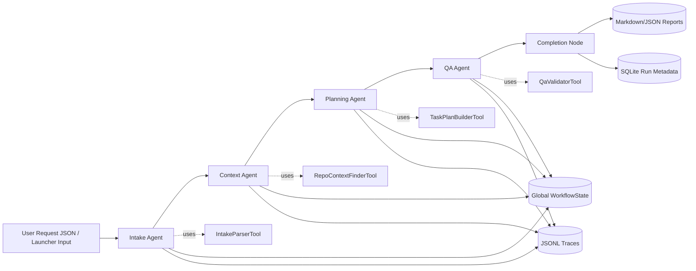

# SE4010 - CTSE Assignment 2
## Technical Report - FlowForge (Local Multi-Agent System)

### Module
SE4010 - Current Trends in Software Engineering

### Assignment
Assignment 2 - Machine Learning (Agentic AI / Multi-Agent Systems)

### Project Title
FlowForge: Local Multi-Agent Software Request Analysis and Planning Assistant

### Team Members
- [Member 1 Name]
- [Member 2 Name]
- [Member 3 Name]
- [Member 4 Name]

---

## 1. Problem Domain

Modern software teams receive bug reports and feature requests in unstructured text. Translating these requests into implementation-ready plans is time-consuming and inconsistent. Teams often miss repository context, constraints, risk analysis, and test planning during early triage.

This project addresses that problem by building a **locally-hosted Multi-Agent System (MAS)** named **FlowForge**. The system accepts a user request, analyzes a local source repository, generates a structured implementation plan, validates quality through a QA stage, and produces persistent reports and traces.

The solution is designed to be fully local, privacy-preserving, and zero-cost.

---

## 2. Technical Stack and Local-Only Compliance

- LLM engine: **Ollama** (local model, default `qwen2.5:3b`)
- Orchestrator: **LangGraph**
- Language: **Python 3.11+**
- Validation/Schema: **Pydantic v2**
- Storage: **SQLite** (local file database)
- Observability: **JSONL trace files**
- UI options: CLI + Rich TUI + interactive launcher
- Testing: **Pytest** (unit, integration, eval suites)

Compliance with assignment constraints:
- No paid cloud APIs are required.
- Execution uses local repository files and local output directories.
- Workflow is designed for local machine operation.

---

## 3. System Architecture

FlowForge uses a 4-agent sequential pipeline:
1. Intake Agent
2. Context Agent
3. Planning Agent
4. QA Agent

Each agent updates a shared typed global state and passes it to the next stage through LangGraph.

### 3.1 Architecture Diagram

### 3.2 Workflow Routing

- Start -> `intake` -> `context` -> `planning` -> `qa` -> `complete` -> End
- Failure handling is captured by node wrapper logic and state error fields.

---

## 4. Agent Design

The system defines four specialized agents, each with focused responsibilities and prompt constraints.

### 4.1 Intake Agent

Purpose:
- Normalize raw user request into structured intent.
- Extract goals, category, severity, and missing information.

Inputs:
- `UserRequest` from initial state.

Outputs:
- `IntakeResult` written into global state.

Reasoning strategy:
- Deterministic tool-assisted parsing first.
- Structured LLM output validated with Pydantic schema.

### 4.2 Context Agent

Purpose:
- Retrieve repository snippets relevant to the request.
- Respect explicit file attachments.

Inputs:
- `UserRequest` + `IntakeResult`.

Outputs:
- `ContextBundle` with selected snippets and summary.

Reasoning strategy:
- Deterministic retrieval/scoring tool first.
- LLM-based structured selection and summarization.
- Deterministic fallback when structured generation fails.

### 4.3 Planning Agent

Purpose:
- Transform request + code context into an implementation-ready task plan.

Inputs:
- `IntakeResult` + `ContextBundle`.

Outputs:
- `PlanResult` containing dependency-aware tasks, criteria, and risks.

Reasoning strategy:
- Prompt conditioning by request category (bug vs feature).
- Post-generation normalization and dependency validation by tool.

### 4.4 QA Agent

Purpose:
- Validate plan readiness and policy/rubric alignment before completion.

Inputs:
- `IntakeResult` + `ContextBundle` + `PlanResult`.

Outputs:
- `QaResult` with approval flag, findings, rubric checks, and summary.

Reasoning strategy:
- Deterministic rule checks first.
- LLM structured review second.
- Deduplicated final findings.

---

## 5. Custom Tools

All tools are custom Python components with type hints, docstrings, and error handling.

### 5.1 IntakeParserTool
- Sanitizes and normalizes raw request fields.
- Produces structured parsed request payload.

### 5.2 RepoContextFinderTool
- Walks local repository files with extension filtering.
- Prioritizes explicitly attached files.
- Scores candidates based on keyword overlap.
- Returns capped snippet set.

### 5.3 TaskPlanBuilderTool
- Validates task dependencies.
- Removes duplicates in dependencies/criteria/risks.
- Sorts tasks for stable plan ordering.

### 5.4 QaValidatorTool
- Applies deterministic quality checks.
- Flags missing goals/snippets/tasks/risks/criteria.
- Applies category-specific bug/feature expectations.

---

## 6. State Management

FlowForge uses a shared typed `WorkflowState` object as global state.

State fields include:
- Request payload
- Intermediate outputs from each agent
- Final artifacts
- Trace file path
- Workflow status lifecycle
- Error list

State is passed node-to-node through LangGraph using a typed `GraphState` wrapper. This avoids context loss and enforces schema consistency across handoffs.

---

## 7. Observability and AgentOps

A JSON trace writer emits one event per node transition to a run-specific `.jsonl` file.

Each event records:
- Timestamp
- Run ID
- Node name
- Status (`started` / `success` / `error`)
- Latency (ms)
- Detail/error text

Additional operational artifacts:
- Markdown report per run
- JSON report per run
- SQLite run history (`runs`) and recent project tracking

---

## 8. Testing and Evaluation Methodology

The project includes three testing layers:

1. Unit tests
- Agent behavior
- Tool behavior
- State and launcher logic
- Ollama client and tracing utilities

2. Integration tests
- End-to-end mocked pipeline execution
- Launcher interactive flow
- Optional live Ollama smoke test

3. Evaluation tests
- Intake field validity checks
- Context output bounding checks
- Planning dependency integrity checks
- QA finding detection checks

This test layout provides correctness coverage for both deterministic logic and agent orchestration behavior.

---

## 9. Individual Contributions

Each student is assigned one agent, one tool, and one evaluation area.

### 9.1 [Member 1 Name]
- Agent: Intake Agent
- Tool: IntakeParserTool
- Evaluation ownership: intake evaluation scenarios
- Challenges faced:
  - [Add challenge]
  - [Add resolution]

### 9.2 [Member 2 Name]
- Agent: Context Agent
- Tool: RepoContextFinderTool
- Evaluation ownership: context evaluation scenarios
- Challenges faced:
  - [Add challenge]
  - [Add resolution]

### 9.3 [Member 3 Name]
- Agent: Planning Agent
- Tool: TaskPlanBuilderTool
- Evaluation ownership: planning evaluation scenarios
- Challenges faced:
  - [Add challenge]
  - [Add resolution]

### 9.4 [Member 4 Name]
- Agent: QA Agent
- Tool: QaValidatorTool
- Evaluation ownership: QA evaluation scenarios
- Challenges faced:
  - [Add challenge]
  - [Add resolution]

---

## 10. Unified Group Testing Harness

The team uses a single shared test harness with:
- Common fixtures (`tests/conftest.py`)
- Shared unit and integration suites
- Per-agent eval files under `tests/evals/`

Each member contributes assertions for their owned agent/tool behavior while running under one unified Pytest workflow.

---

## 11. Execution and Demonstration Summary

Execution modes:
- Direct CLI with `--repo-path` and `--input-file`
- Interactive launcher mode
- Optional Rich TUI rendering

Expected output artifacts:
- `data/reports/<run_id>.md`
- `data/reports/<run_id>.json`
- `data/traces/<run_id>.jsonl`
- `data/app.db`

Demo video guideline:
- Duration: 4-5 minutes (do not exceed 5 minutes)
- Show full 4-agent run, generated artifacts, and trace output

---

## 12. Repository Link

- GitHub/GitLab Repository: [Add Repository URL]

---

## 13. Conclusion

FlowForge demonstrates a local-first MAS implementation using LangGraph and Ollama, with four specialized agents, custom tool integration, typed global state transfer, and observable execution traces. The system addresses multi-step software request analysis while maintaining privacy and zero cloud cost.

