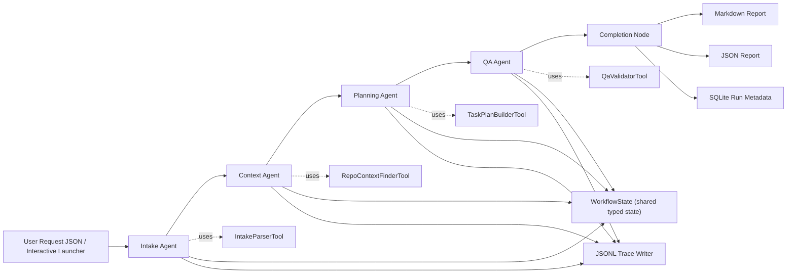

# SE4010 - CTSE Assignment 2
## Technical Report - FlowForge

### Module
SE4010 - Current Trends in Software Engineering

### Assignment
Assignment 2 - Machine Learning (Agentic AI / Multi-Agent Systems)

### Project Title
FlowForge: A Local Multi-Agent Assistant for Software Request Analysis and Planning

### Team Members

- Pawara Sasmina
- Yehara Dananjaya
- Sankalani
- Osanda

### Repository

- https://github.com/LSYDananjaya/SE4010-CTSE-Assignment-02-FLOWFORGE

---

## 1. Problem Domain

Software teams constantly receive bug reports and feature requests in informal language. Before development can begin, those requests need to be classified, clarified, mapped to code, converted into an execution plan, and checked for quality. In many student and small-team environments this triage is manual, inconsistent, and poorly documented.

FlowForge addresses this problem by acting as a local multi-agent engineering assistant. A user provides a request plus a repository path, and the system performs a sequence of focused reasoning steps:

1. Normalize the request.
2. Retrieve relevant repository evidence.
3. Build an implementation-ready plan.
4. Validate the result against deterministic quality checks and rubric expectations.

This is a stronger fit for the assignment than a generic chatbot because the system is not merely conversational. It is a structured, tool-using, stateful agent pipeline that operates over a real local repository and produces concrete engineering artifacts.

---

## 2. Technical Stack and Local-Only Compliance

- LLM engine: **Ollama**
- Default model: **qwen2.5:3b**
- Orchestrator: **LangGraph**
- Language: **Python 3.11+**
- Schema validation: **Pydantic v2**
- Persistence: **SQLite**
- Observability: **JSONL traces**
- Terminal UX: **CLI**, **Rich TUI**, and **interactive launcher**
- Test framework: **Pytest**

FlowForge satisfies the zero-cost local-only constraint in the assignment brief:

- No paid API keys are required.
- All inference runs through a local Ollama server.
- File retrieval, persistence, traces, and reports are stored on the local machine.
- The workflow does not depend on OpenAI, Anthropic, or any paid external service.

---

## 3. System Architecture

FlowForge uses a 4-agent sequential pipeline. Each agent has one clear responsibility and passes validated output to the next stage through a shared typed workflow state.

### 3.1 High-Level Architecture



### 3.2 Workflow Routing

- `START -> intake -> context -> planning -> qa -> complete -> END`
- Each LangGraph node is wrapped by trace emission logic in `src/flowforge/graph/nodes.py`.
- If any agent fails, the workflow status is changed to `failed`, the error is stored in shared state, and the failure cause is written to the trace file.

### 3.3 Why This Architecture Fits the Problem

- The request needs different reasoning styles at different stages.
- Repository retrieval should not be mixed with planning.
- QA should not be merged into planning because rubric validation and completeness checking are a separate concern.
- A sequential pipeline reduces coordination ambiguity and is easier to explain, trace, test, and defend during a viva.

---

## 4. Agent Design

Each agent uses a tailored prompt plus a deterministic tool. This is important for local SLMs because smaller models need tighter instructions and more pre-structured input than large hosted models.

### 4.1 Intake Agent

**Responsibility**

- Convert the raw request into a structured `IntakeResult`.
- Extract category, severity, scope, goals, missing information, and a concise summary.

**Prompt strategy**

- Tells the model to act only on the provided request.
- Prevents repository hallucinations at the first stage.
- Forces explicit goal extraction and conservative summaries.

**Reasoning logic**

- `IntakeParserTool` first normalizes whitespace and drops empty constraints.
- The LLM then produces a typed `IntakeResult`.
- This keeps the prompt cleaner and prevents noise from weakening the classifier.

### 4.2 Context Agent

**Responsibility**

- Retrieve the smallest useful set of repository snippets for the request.
- Respect explicit attachments and summarize why the selected files matter.

**Prompt strategy**

- Instructs the model to use only retrieved local candidates.
- Tells it to favor high-signal implementation files over generic repository content.
- Makes attachment priority explicit.

**Reasoning logic**

- `RepoContextFinderTool` scores files using attachment priority plus keyword overlap.
- The agent asks the model to convert candidates into a structured `ContextBundle`.
- If structured generation fails, a deterministic fallback still returns top candidates so the run remains usable.

### 4.3 Planning Agent

**Responsibility**

- Transform the normalized request and repository evidence into an implementation-ready plan.

**Prompt strategy**

- Uses category-aware reasoning:
  - bugs: reproduction, root cause, validation, regression protection
  - features: requirements, UX/API impact, rollout, edge cases
- Forces dependencies, risks, and acceptance criteria to appear in every task.

**Reasoning logic**

- The LLM first creates a structured `PlanResult`.
- `TaskPlanBuilderTool` then validates dependencies, removes duplicates, and rejects cycles.
- This is critical because typed output alone does not guarantee a valid execution graph.

### 4.4 QA Agent

**Responsibility**

- Decide whether the plan is complete, rubric-aligned, and ready for implementation.

**Prompt strategy**

- Explicitly combines deterministic QA findings with model review.
- Checks category-specific expectations and general rubric requirements such as local-only compliance and observability.

**Reasoning logic**

- `QaValidatorTool` performs deterministic checks first.
- The LLM returns a structured `QaResult`.
- Final findings are deduplicated and merged so deterministic warnings are never lost.

---

## 5. Custom Tool Design

The assignment requires every student to build a real custom Python tool. In FlowForge, each agent depends on a tool that handles non-trivial deterministic logic before or after model inference.

### 5.1 IntakeParserTool

**File:** `src/flowforge/tools/intake_parser.py`

**Purpose**

- Normalize whitespace-heavy requests.
- Remove blank and duplicate constraints.
- Reject semantically empty requests after normalization.

**Why it matters**

- Small models perform better when inputs are clean and compact.
- Rejecting whitespace-only content protects the rest of the workflow from low-signal prompts.

### 5.2 RepoContextFinderTool

**File:** `src/flowforge/tools/repo_context_finder.py`

**Purpose**

- Walk the local repository safely.
- Prioritize explicitly attached files.
- Score candidates using normalized query and constraint keywords.
- Skip oversized, unreadable, or irrelevant files.
- Block path traversal attempts outside the repository root.

**Why it matters**

- The planning agent should not search the repository by itself.
- Tooling creates a repeatable, inspectable retrieval layer.

### 5.3 TaskPlanBuilderTool

**File:** `src/flowforge/tools/task_plan_builder.py`

**Purpose**

- Normalize task ordering.
- Reject self-dependencies, unknown dependencies, and dependency cycles.
- Deduplicate acceptance criteria and risks.

**Why it matters**

- LLMs can produce structurally valid but logically inconsistent task graphs.
- This tool ensures the final plan is execution-ready, not just well-formed JSON.

### 5.4 QaValidatorTool

**File:** `src/flowforge/tools/qa_validator.py`

**Purpose**

- Enforce deterministic quality checks before final approval.
- Flag missing goals, snippets, tasks, risks, and acceptance criteria.
- Check local-only evidence, observability coverage, and category-specific plan quality.

**Why it matters**

- A final QA gate should not depend only on model judgment.
- Deterministic checks make the workflow more trustworthy and easier to explain in the demo.

### 5.5 Example Tool Usage

```python
retrieval = RepoContextFinderTool(max_files=5, snippet_chars=600).run(
    repo_path=request.repo_path,
    query=f"{request.title}\n{request.description}\n{' '.join(intake.goals)}",
    constraints=request.constraints,
    attachments=request.attachments,
)
```

This shows the Context Agent using a custom tool to interact with the real repository before any LLM reasoning occurs.

---

## 6. State Management

FlowForge uses a shared `WorkflowState` model in `src/flowforge/models/state.py`. This state is passed through LangGraph so that every agent receives the validated output of earlier agents.

### 6.1 Important State Fields

- `request`
- `intake_result`
- `context_bundle`
- `plan_result`
- `qa_result`
- `artifacts`
- `trace_file`
- `trace_context`
- `workflow_status`
- `errors`

### 6.2 Why This State Design Is Strong

- It prevents context loss between agent handoffs.
- Every stage reads typed data instead of raw strings.
- Trace metadata can now be stored per agent through `trace_context`.
- The final JSON report is simply a serialized version of the workflow state, which keeps artifacts consistent.

---

## 7. Observability and AgentOps

Observability is a major grading criterion, so FlowForge now captures more than simple node success/failure logs.

### 7.1 Trace Fields Captured Per Node

Each JSONL trace event can record:

- timestamp
- run ID
- node name
- status
- latency
- detail
- agent input summary
- tool name
- tool input summary
- tool output summary
- fallback-used flag
- LLM output summary
- failure cause

### 7.2 Why This Matters

- The team can explain not only **what** agent ran, but also **what it received**, **which tool it used**, and **what it produced**.
- The demo can show concrete evidence of state handoff and tool invocation.
- Failures are easier to debug because the trace captures context, not just status codes.

### 7.3 Example Trace Payload

```json
{
  "timestamp": "2026-04-21T00:00:00+00:00",
  "run_id": "run-20260421-000000-000000",
  "node_name": "context",
  "status": "success",
  "latency_ms": 12.34,
  "detail": "",
  "agent_input_summary": "category=feature, goals=1, attachments=1",
  "tool_name": "RepoContextFinderTool",
  "tool_input_summary": "repo_path=C:/repo, constraints=1, attachments=['src/components/CategoryPicker.tsx']",
  "tool_output_summary": "files_considered=2, candidates=2, missing_attachments=0",
  "fallback_used": false,
  "llm_output_summary": "selected_snippets=1, summary=Attached component selected first.",
  "failure_cause": ""
}
```

---

## 8. Testing and Evaluation Methodology

The assignment asks for automated evaluation scripts per student. FlowForge uses three testing layers:

### 8.1 Unit Tests

Unit tests validate agents, tools, state handling, tracing, persistence, launcher behavior, and prompt-driven branching.

Examples:

- `tests/unit/test_intake_agent.py`
- `tests/unit/test_context_agent.py`
- `tests/unit/test_planning_agent.py`
- `tests/unit/test_qa_agent.py`
- `tests/unit/test_tracing.py`

### 8.2 Integration Tests

Integration tests validate workflow assembly and user-facing execution modes.

Examples:

- `tests/integration/test_end_to_end_mocked.py`
- `tests/integration/test_main_entrypoint.py`
- `tests/integration/test_launcher_flow.py`
- `tests/integration/test_end_to_end_live_ollama.py`

### 8.3 Evaluation Tests

Each member owns evaluation scenarios for their agent/tool pair:

- Intake: field completeness and malformed-input rejection
- Context: snippet bounds and attachment escape blocking
- Planning: dependency integrity and cycle rejection
- QA: missing acceptance criteria, observability, and local-only evidence

### 8.4 Reliability and Security-Oriented Checks

The evaluation suite includes more than happy paths:

- whitespace-only request normalization failures
- attachment path traversal attempts
- dependency cycles inside the task graph
- plans that omit observability or local-only evidence

These checks strengthen the project against both accidental misuse and adversarial inputs.

---

## 9. Unified Testing Harness

The group uses one shared Pytest harness:

- common fixtures in `tests/conftest.py`
- unit tests under `tests/unit/`
- integration tests under `tests/integration/`
- per-agent evaluation tests under `tests/evals/`

This structure supports both group-level workflow testing and individual contribution proof.

---

## 10. Individual Contributions

### 10.1 Pawara Sasmina

- Agent: Intake Agent
- Tool: IntakeParserTool
- Evaluation ownership: intake validation and malformed-input rejection
- Main challenge: detecting requests that become empty after normalization
- Resolution: added deterministic post-normalization rejection before prompting

### 10.2 Yehara Dananjaya

- Agent: Context Agent
- Tool: RepoContextFinderTool
- Evaluation ownership: retrieval quality, snippet bounds, and attachment safety
- Main challenge: prioritizing relevant code while preventing unsafe path access
- Resolution: attachment-first retrieval, scoring, path-root checks, and bounded snippets

### 10.3 Sankalani

- Agent: Planning Agent
- Tool: TaskPlanBuilderTool
- Evaluation ownership: dependency validation and cycle rejection
- Main challenge: making structured plans logically executable, not just schema-valid
- Resolution: deterministic dependency validation and cycle detection after LLM generation

### 10.4 Osanda

- Agent: QA Agent
- Tool: QaValidatorTool
- Evaluation ownership: rubric validation, observability coverage, and trace quality
- Main challenge: making QA findings explainable instead of opaque
- Resolution: deterministic QA checks plus richer AgentOps trace payloads

---

## 11. Demonstration Plan

The demo should stay within 4-5 minutes and show:

1. The local Ollama model list or local inference setup.
2. A direct CLI run against a sample request.
3. The generated Markdown and JSON reports.
4. The JSONL trace file with tool and LLM summaries.
5. The SQLite run metadata file.
6. A quick explanation of which member built which agent/tool pair.

The presentation should avoid lengthy setup steps. The focus should be the working local workflow and the observable handoff between agents.

---

## 12. Conclusion

FlowForge demonstrates a complete local-first multi-agent architecture for software request analysis. The system uses four specialized agents, four custom tools, shared typed state, local Ollama inference, deterministic validation, and structured observability. Because it works on real repository files and produces inspectable artifacts, it aligns closely with the assignment’s goals for Agentic AI rather than behaving like a generic chatbot.
